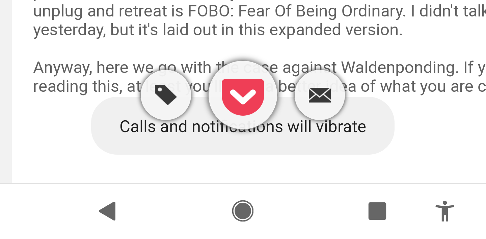

You're all done with setting up. If you need to change anything then look in the menu.

<section id="getting_started">

## Getting Started

Because you are a dearly beloved 🦙 alpha tester ⚗ the subscription is only \$1AUD, and for you, that's for as long as this thing keeps going.

Before we can send you anything, we need a few things from you:

- ❓

  [How long your articles should be](editorial)

  🧾

- ❓

  [A connection to your Pocket account](pocket)

  <svg class="logo-full" xmlns="http://www.w3.org/2000/svg" viewBox="0 20 115 130" height="24px"><path fill="#EF4056" d="M84.058 83.308L58.54 107.324c-1.313 1.5-3.377 2.065-4.878 2.065-1.876 0-3.752-.564-5.253-2.065L23.266 83.308c-2.627-2.814-3.002-7.505 0-10.507 2.814-2.627 7.505-3.002 10.32 0l20.076 19.325L74.114 72.8c2.627-3.002 7.317-2.627 9.944 0 2.627 3.002 2.627 7.693 0 10.507M97.005 43.53H10.32C4.691 43.53 0 47.846 0 53.475v32.084c0 29.083 24.016 53.288 53.662 53.288 29.458 0 53.287-24.205 53.287-53.288V53.475c0-5.63-4.503-9.945-9.944-9.945"></path></svg>

- ❓

  [Some payment and address details](payment)

  💳

Once you've got three green ticks you can:

<form action="/activate" method="POST" class="form" id="activate-form">
<button>Activate your subscription</button>
</form>

Collect the ticks and you will unlock greatness.

</section>

<section>

## Tips

<figure>

<figcaption>You can tag from inside the Pocket app or, at least in Android, you can do it as you save it.

</figcaption>

</figure>

If you especially want a particular article to be in the upcoming edition,
then tag it with <code>wpMustPrint</code>. If you don't want something to be
printed, then tag it with <code>wpNoPrint</code>.

Articles with computer code can be hard to read because the lines are
sometimes really long, you can't exclude them yet but we're working on it.

Wikipedia articles are sometimes a bit of a challenge too because they have
can have huge tables and so many links to other parts of the page.

</section>

# debug data

Don't worry about this, it's so that I can see everything, but it's here in case
you're interested in what data we've captured about you.

<section>

## Editorial

Each edition I'd like to read <a href="/editorial">X</a> minutes of articles I already know I want to read.

I'd like the articles to be between <a href="/editorial">X and Y</a> minutes long.

I <a href="/editorial">don't want</a> articles with computer code in them.

<!-- <li>weeks_to_select_from: </li> -->
</section>

<section>

## Profile

- name: A. Cool-name
- email: Anna@kool.kom
- picture: 
- user_id: asd6s9f6bdf875bdb7as

</section>

<section>

## Address

<a href="/address">
    A. Cool-name
     Flat 6
     Cool House
     Cool Town
     C001
     KY
     Australia</a>

</section>

<section>

## Pocket

- pocket_request_token: ccccccc
- pocket_access_token: ddddddd

---

Here's some articles you saved recently:

<ul id="articlelist"></ul>

</section>

<section>

## Payment

Surprise! It's a dollar an issue because you're an alpha user. It'll be $10 an 
issue for everyone else when it comes out of alpha, but it'll be $1 an issue
for you, forever!

- currency: AUD
- price: \$0

</section>

<!-- The core Firebase JS SDK is always required and must be listed first -->

<!-- TODO: Add SDKs for Firebase products that you want to use
  https://firebase.google.com/docs/web/setup#available-libraries -->

