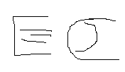

Walden Pond comes out once a month, you can get 1, 2 or 4 hours of content in each edition.

Once you've signed up, you can change the length of your editions, or cancel your subscription at any time.

<!-- Load Stripe.js on your website. -->

<!-- Create a button that your customers click to complete their purchase. Customize the styling to suit your branding. -->

# Printed

<!--  -->

# 1 hour

<!--  -->

# 2 hours

<!--  -->

# 4 hours

<button
  id="checkout-button-plan_HGJqSiZXIdOaxk"
  role="link"
  tabindex="0"
  class="disabled checkout-button"
  title="Subscribe with Stripe">
1 hour
⏳📖
<!-- Subscribe with Stripe -->
$10
</button>

<button
  id="checkout-button-plan_HGJvNc7jY9ZRrR"
  role="link"
  tabindex="0"
  class="disabled checkout-button"
  title="Subscribe with Stripe">
2 hours
⏳⏳📖
<!-- Subscribe with Stripe -->
$12
</button>

<button
  id="checkout-button-plan_HGJyibrCINh1Uf"
  role="link"
  tabindex="0"
  class="disabled checkout-button"
  title="Subscribe with Stripe">
4 hours
⏳⏳⏳⏳📖
<!-- Subscribe with Stripe -->
$14
</button>

Click this button to change or cancel your subscription. It'll take you to Stripe's website. We don't ever see your payment details.

<button id="manage-payment-button">Manage billing</button>



